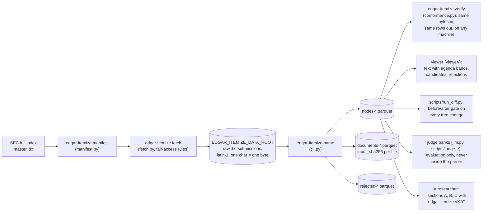
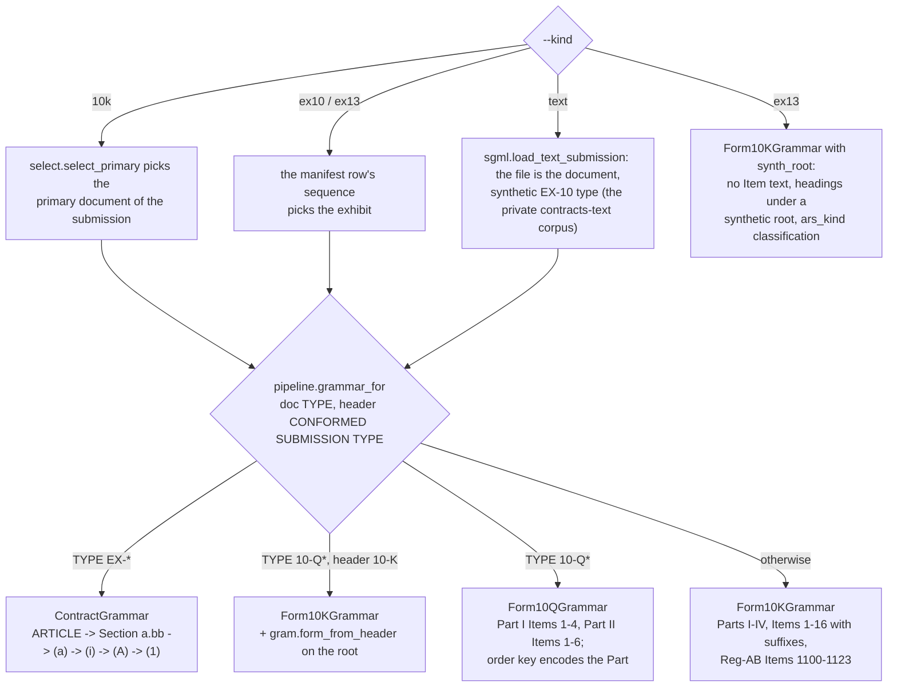
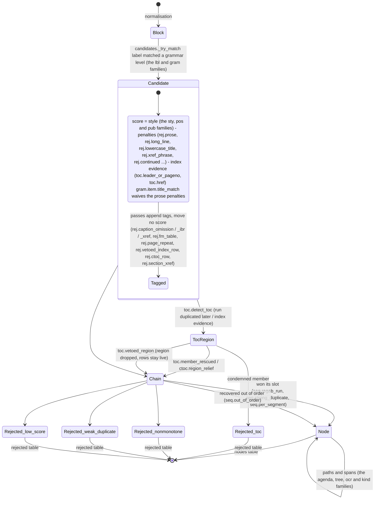
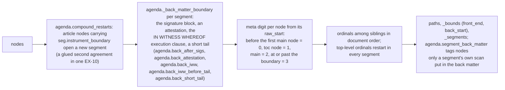
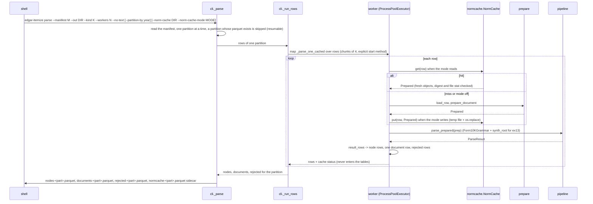
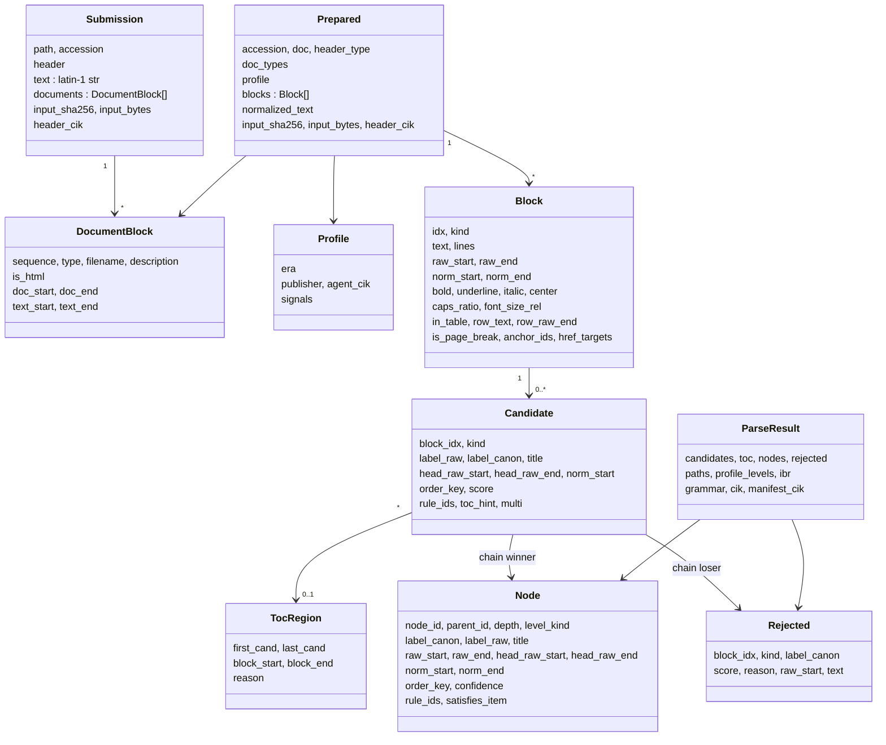

# Architecture: how a filing becomes a tree

Hand-drawn diagrams of the parser's flow, written 2026-09-29 against the 1.0.0rc1 source.
They render in Obsidian and on GitHub (Mermaid). The generated companion is
`docs/RULES.md`, the catalogue of every rule id and rejected reason with the module that
writes it and the module that reads it; that file is regenerated from the source and tested,
this one is checked by hand at each turn close (`docs/PROJECT_GUIDE.md`, turn cadence). For
what the output tables promise, read `docs/OUTPUT_CONTRACT.md`; for the viewer and judge
loop around the parser, `docs/WORKFLOW.md`.

Rendered SVGs of every diagram are under `docs/diagrams/` (`scripts/render_diagrams.py`,
mermaid-cli in Docker; rerun after editing). Module names below are files under `src/edgar_itemize/`; a name in the form `module.function`
is where to open the source.

## 1. From EDGAR to a citation

Everything a node says about a filing is a pair of byte offsets into the raw submission
file plus the label, title and provenance the parser attached, so results are shareable
without redistributing filings, and `verify` can prove a machine reproduces them.

## 2. One document through the parser

`pipeline.parse_document` is `prepare.prepare_document` followed by
`pipeline.parse_prepared`. The first half is the cacheable prefix: `normcache` keys it on a
digest of the source of every module it can execute, so a cache hit hands `parse_prepared`
exactly what a fresh parse would.

```mermaid
flowchart TD
    subgraph prepare["prepare.prepare_document  (cached by normcache when --norm-cache is on)"]
        direction TB
        load["prepare.load_row: read the submission<br/>(sgml.read_submission_hashed: input_sha256)<br/>and pick the document by kind"]
        split["sgml.split_documents: DOCUMENT blocks<br/>by byte offset; PEM / IMS wrappers handled"]
        classify["classify.classify: Profile<br/>era (text, html_early, html_publisher, ixbrl, image_text)<br/>publisher (agent CIK prefix, generator fingerprints)"]
        ix["sgml.blank_ix_header (ixbrl only):<br/>blank in place so offsets never move"]
        norm{"profile.era"}
        ntext["normalize_text.text_to_blocks"]
        nhtml["normalize_html.html_to_blocks<br/>(vendored CPython 3.11 HTMLParser)"]
        blocks["Blocks: text, raw_start/raw_end,<br/>norm_start/norm_end, style flags,<br/>table-row context, page breaks, anchors"]
        prepared["Prepared: doc, header type, Profile,<br/>blocks, normalized text, header CIK, input hash"]
        load --> split --> classify --> ix --> norm
        norm -- text --> ntext --> blocks
        norm -- html / ixbrl / image_text --> nhtml --> blocks
        blocks --> prepared
    end

    subgraph parse["pipeline.parse_prepared"]
        direction TB
        gram["pipeline.grammar_for: Form10K / Form10Q / Contract<br/>(section 3)"]
        cands["candidates.find_candidates: every block whose text<br/>starts with a level label, scored (section 5)"]
        g10k{"form10k?"}
        cap["candidates.caption_guard_pass<br/>candidates.fm_table_pass<br/>(tags only: rej.caption_*, rej.fm_table)"]
        toc["toc.detect_toc: dense candidate runs duplicated later<br/>or carrying index evidence -> TocRegion;<br/>toc._contract_regions for contracts;<br/>toc.veto_chain_completing (toc.vetoed_region)"]
        prp["candidates.page_repeat_pass (rej.page_repeat)"]
        kind{"grammar"}
        cpass["candidates.ctoc_row_pass (rej.ctoc_row, ctoc.region_relief)<br/>candidates.section_xref_pass (rej.section_xref)"]
        ctree["tree_contract.build_contract_tree<br/>(section 4b)"]
        vpass["candidates.vetoed_index_row_pass<br/>(10-K / 10-Q, not EX-13: rej.vetoed_index_row)"]
        ktree["tree.build_tree (section 4a)"]
        regab{"10-K and an untitled Reg-AB item<br/>accepted past the back matter?"}
        rebuild["agenda.regab_back_matter tags rej.regab_back_matter,<br/>tree.build_tree runs again"]
        heads["headings.find_headings + merge_and_renumber:<br/>styled short blocks inside Items become depth 3+<br/>heading nodes; rej.page_banner rows go to rejected"]
        ex13["EX-13 only: synthetic root item (gram.synth_doc_root, never written);<br/>ars_kind.classify -> satisfies_item, kind.*"]
        stamps["ocr.degraded (image_text era)<br/>gram.form_from_header (10-Q tag, 10-K header)"]
        paths["agenda.assign_paths: segments (compound exhibits),<br/>back-matter boundary, meta digit 0/1/2/3, ordinals"]
        trunc["tree.truncate_at_back_start: main-body spans stop<br/>at the back matter (tree.back_truncate);<br/>re-parent orphaned headings, re-run assign_paths"]
        ibr["classify.ibr_flags on each Item span<br/>(incorporated by reference, cross reference)"]
        result["ParseResult -> pipeline.result_rows:<br/>nodes, one documents row, rejected rows"]
        gram --> cands --> g10k
        g10k -- yes --> cap --> toc
        g10k -- no --> toc
        toc --> prp --> kind
        kind -- contract --> cpass --> ctree --> heads
        kind -- form10k / form10q --> vpass --> ktree --> regab
        regab -- yes --> rebuild --> heads
        regab -- no --> heads
        heads --> ex13 --> stamps --> paths --> trunc --> ibr --> result
    end

    prepared --> gram
```

Two things the picture cannot show. First, most passes are *tags only*: they append a rule
id to a candidate and move no score, and one named later stage reads the tag
(`docs/RULES.md`, "Which stage reads what another wrote"). That is how a rule stays scoped to
the corpus it was gated on. Second, the order is load-bearing: `vetoed_index_row_pass` runs
after `detect_toc` because its whole input is the veto's tags; `fm_table_pass` runs before
`detect_toc` because `detect_toc` reads none of its tags, so every TOC region is
bit-identical with the pass on or off. The comments in `pipeline.parse_prepared` say, for
each pass, why it sits where it does.

## 3. Grammar routing

A grammar is a tuple of `LevelSpec`s (`grammar/base.py`): a kind, a nominal depth, an
anchored pattern, and whether the level is canonical-only (10-K items) or may share its
paragraph with body text (contract sections and clauses). `label_rules` in each grammar
module explains how a label was read (`gram.item.roman`, `gram.item.word`,
`gram.item.suffix_refused`, ...).

## 4. The two tree builders

Both take the candidate list and the TOC regions and return `(nodes, rejected)`. Both
select, per level, the **maximum-weight strictly increasing subsequence** of candidates by
grammar order key (`tree.max_weight_increasing`): deterministic, no thresholds beyond a
minimum score, tolerant of undetected contents pages (their rows carry less weight) and of
cross-references (negative evidence). Nothing is greedy.

### 4a. Form 10-K / 10-Q: `tree.build_tree`

```mermaid
flowchart TD
    in["candidates + TOC regions"]
    condemn["members of a TOC region are rejected (reason toc)<br/>unless the row is the document's only strong copy<br/>of its label: toc.member_rescued"]
    tagged["rej.vetoed_index_row and rej.regab_back_matter rows<br/>are rejected before anything is chained"]
    q["form10q: 'ITEM ?.' labels get their Part<br/>from the nearest preceding live Part"]
    chain["per level kind: max-weight increasing chain<br/>over (order_key, chain_weight);<br/>index-looking rows weigh less"]
    regab["form10k: Reg-AB items chained as their own run<br/>(seq.regab_run) and reunited with the ordinary items"]
    dup["tree.strong_duplicate_pass (10-K / 10-Q items):<br/>a later, stronger copy displaces a weak one<br/>(seq.strong_duplicate; loser: weak_duplicate)"]
    ooo["tree.out_of_order_items: an item the chain could not<br/>place but the document really typesets<br/>(seq.out_of_order); rej.caption_*, rej.fm_table,<br/>rej.xref_pointer block it"]
    lose["chain losers: nonmonotone;<br/>below the minimum score: low_score"]
    build["nodes: document root (doc), one toc node per region<br/>(its reason as rule id), Parts explicit or synthesised<br/>(gram.synth_part, gram.part_opened_early,<br/>gram.part_after_item), Items under their Part"]
    s1["form10q: tree._synth_item1 when Part I's<br/>Item 1 is only a run-in (gram.synth_item1)"]
    ends["ids in document order; each node ends where the next<br/>node at its depth or shallower begins; a Part covers<br/>its children except out-of-order ones"]
    in --> condemn --> tagged --> q --> chain --> regab --> dup --> ooo --> lose --> build --> s1 --> ends
```

### 4b. Contracts (EX-10, `--kind text`): `tree_contract.build_contract_tree`

```mermaid
flowchart TD
    in["candidates + TOC regions"]
    condemn["region members rejected (toc) unless rescued<br/>(toc.member_rescued) or relieved (ctoc.region_relief);<br/>rej.ctoc_row rows rejected (toc);<br/>rej.section_xref rows rejected (section_xref)"]
    restarts["agenda.chain_restarts: where ARTICLE numbering restarts<br/>(chain.restart; chain.section_restart for section-only<br/>restarts) and whether a new instrument begins there<br/>(seg.instrument_boundary from seg.prior_closed,<br/>seg.new_title, seg.new_parties; else chain.restart_unsegmented)"]
    chains["one article chain and one section chain per restart<br/>(seq.per_segment); the restart candidate heads its chain"]
    orphan["a vetoed reference that would have held a chain slot<br/>gets a synthetic section for its clauses<br/>(gram.synth_section_xref)"]
    nodes["nodes: document root, toc nodes, articles (missing one<br/>synthesised: gram.synth_article), sections keyed by<br/>(chain, order key) so two ARTICLE 1s never collide"]
    clauses["clauses: sequence.sequence per section span, a Viterbi pass<br/>over stack states with deterministic costs (skip, restart,<br/>open high, family change): seq.gap*, seq.restart,<br/>seq.open_midrun, seq.alt_readings; unplaceable: clause_nonmonotone"]
    gaps["clauses outside any section: relief under an article<br/>(gram.clause_under_article, gram.synth_section)<br/>or clause_outside_section"]
    titles["tree_contract.attach_bare_titles: a bare title line above<br/>or beside a label becomes the node's title<br/>(gram.title_above_label, gram.title_adjacent_line)"]
    in --> condemn --> restarts --> chains --> orphan --> nodes --> clauses --> gaps --> titles
```

## 5. A candidate's life

What `rule_ids` on a node or a rejected row is telling you, in the order the tags arrive.

A rejected row carries the *last* decision as its `reason` (a closed vocabulary) and not
the tags that led there; a node carries every tag. The rejected reasons and their
baseline counts are in `docs/OUTPUT_CONTRACT.md` section 7.6.

## 6. Paths, segments and the back matter

`agenda.assign_paths` gives every node a fixed-length path: `path[0]` is the meta digit
(0 front matter, 1 contents, 2 main body, 3 back matter), the rest are 1-based ordinals of
appearance among siblings, zero-padded. Labels are deliberately not in the digits (Item
numbering has gaps; clause schemes vary); the canonical label is its own column.

`tree.truncate_at_back_start` then clamps every main-body span at `back_start`, so the
last Item no longer runs over the signature page and the exhibit index; a heading that
loses its parent's cover is re-parented, never re-spanned (`tree.back_truncate_descend`).

## 7. A run: the CLI, workers and the cache

An exception in one document becomes a documents row with `error` set and no node rows;
the run continues. The tables are identical with the cache on or off; only the sidecar
says which rows the cache supplied. `edgar-itemize verify` runs the same path over the
conformance set and compares per-document output hashes with the committed expectations.

## 8. The objects

Node and rejected rows are written by `pipeline.result_rows`; the columns and their
promises are `docs/OUTPUT_CONTRACT.md` sections 5 to 8.

## 9. Where to look

| stage | module | tests | design record |
|---|---|---|---|
| SGML split, hashing, header CIK | `sgml.py` | `test_sgml.py`, `test_header_cik.py` | `docs/RELEASE_PLAN.md` section 9 (D9) |
| era and publisher | `classify.py` | `test_classify_abs.py` | `docs/PILOT_REPORT.md` |
| normalisation | `normalize_text.py`, `normalize_html.py`, `_html_parser.py` | `test_normalize*.py`, `test_html_parser_vendored.py` | `docs/RELEASE_PLAN.md` R1e |
| normalisation cache | `normcache.py`, `prepare.py` | `test_normcache.py` | `docs/turn13_decisions/infra_normalize_cache.md` |
| grammars | `grammar/form10k.py`, `form10q.py`, `contract.py` | `test_labels.py`, `test_form10q*.py`, `test_turn12_b4_labels.py` | `docs/turn12_decisions/a4_label_family.md` |
| candidates and the tag passes | `candidates.py` | `test_turn9_caption_guard.py`, `test_turn10_fm_table.py`, `test_turn11_ctoc.py`, `test_turn12_vetoed_index.py`, `test_turn13_section_xref.py` | the matching `docs/turnN_decisions/` memo (`docs/RULES.md` links them) |
| contents detection | `toc.py` | `test_toc_turn3.py`, `test_toc_contract.py` | `docs/turn9_decisions/a6_index_regions.md` |
| 10-K / 10-Q tree | `tree.py` | `test_tree.py`, `test_turn8_out_of_order.py`, `test_turn9_strong_duplicate.py`, `test_turn13_b1_regab.py` | `docs/turn8_decisions/a5_out_of_order.md`, `docs/turn13_decisions/a6a_regab.md` |
| contract tree and clauses | `tree_contract.py`, `sequence.py` | `test_contract.py`, `test_sequence.py`, `test_turn12_clauses.py`, `test_compound.py` | `docs/turn12_decisions/a2_clause_layer.md`, `docs/turn7_decisions/d_compound.md` |
| paths, segments, back matter | `agenda.py` | `test_agenda.py`, `test_turn10_backmatter_guard.py` | `docs/turn7_decisions/a_appendix.md`, `docs/turn8_decisions/b2b_chain_vs_segment.md` |
| sub-headings | `headings.py` | `test_headings.py`, `test_turn12_page_banner.py` | `docs/turn12_decisions/a3_subheadings.md` |
| EX-13 | `ars_kind.py` | `test_ex13.py` | `docs/turn7_decisions/b_ex13.md` |
| document selection, wiring and rows | `select.py`, `pipeline.py`, `cli.py` | `test_turn4.py`, `test_text_input.py` | `docs/OUTPUT_CONTRACT.md` |
| reproducibility | `conformance.py`, `manifest.py`, `fetch.py` | `test_conformance.py`, `test_manifest_fetch.py` | `docs/RELEASE_PLAN.md`, `docs/VERSIONING.md` |

Planned, not built: a per-document stage trace in the viewer (the same filing shown after
each stage of section 2, with every `rule_ids` entry linking into `docs/RULES.md`), logged
as a Turn 14 item in `docs/RELEASE_PLAN.md`; and print-quality figures of sections 1 and 2
for the paper, logged there too.
