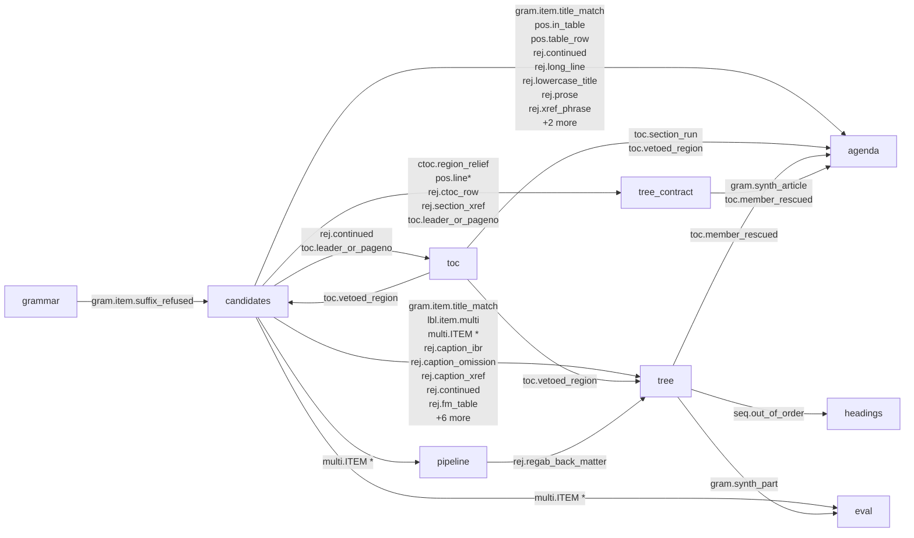

# Rule ids and rejected reasons

Generated by `scripts/rules_catalogue.py` from the source under `src/edgar_itemize/`; do not
edit by hand. `tests/test_rules_catalogue.py` fails when this file is stale, so regenerate it
with `uv run python scripts/rules_catalogue.py` after adding, retiring or moving a rule id.

`rule_ids` is the provenance column of the node table (`docs/OUTPUT_CONTRACT.md` section
8.2): every rule that proposed, scored, placed, re-parented or tagged a node, in the order
they fired. It is an open vocabulary. `rejected.reason` (section 7.6) is the closed
vocabulary of the rejected table. For where the stages sit, see `docs/ARCHITECTURE.md`.

**Emitted in** is where the id is appended, returned or assigned into a rule list;
**read in** is where a later stage tests for it. An id with no emitter is read by the
evaluation code for a rule that no longer fires; an id with no reader is a description
only, written for the tables and the viewer. The classification is syntactic
(the script's docstring says how); the source line is one `grep` away.

102 literal ids, 7 dynamic patterns, 9 rejected reasons; 108 ids have an emitter.

## Families

| family | meaning | ids |
|---|---|---:|
| `lbl` | the grammar level a label matched (`lbl.part`, `lbl.item`, ...), and `lbl.item.multi` for a combined heading | 2 |
| `gram` | grammar and label matching: how the label was read, canonicalised or synthesised | 24 |
| `sty` | style evidence on the block (bold, caps, centred, larger font, ...) | 8 |
| `pos` | position evidence (anchor target, head line only, table row, short block, line k of the block) | 7 |
| `pub` | publisher-specific evidence | 1 |
| `toc` | table-of-contents evidence and region decisions | 13 |
| `ctoc` | contract table-of-contents boundary (Turn 11) | 2 |
| `fm` | front-matter table rows (Turn 10) | 1 |
| `rej` | penalties and vetoes that were applied to a candidate | 18 |
| `seq` | sequencing decisions: chain, out-of-order placement, duplicates, clause sequencing | 12 |
| `chain` | numbering restarts in a contract (one chain per restart) | 3 |
| `seg` | instrument boundaries in a compound exhibit (segments) | 4 |
| `agenda` | back-matter and segment placement (the meta digit) | 7 |
| `tree` | span and parent changes after the tree is built | 2 |
| `kind` | EX-13 heading classification into the 10-K item it satisfies | 1 |
| `multi` | the further items a combined heading covers (`multi.ITEM <k>`) | 1 |
| `ocr` | structure recovered from an OCR text layer | 1 |
| `omit` | omission statements (read by the evaluation metrics; no current emitter) | 1 |
| `doc` | the document root node | 1 |

## Which stage reads what another wrote

Every edge is a rule id one stage writes onto a candidate or node and a later stage tests
for. Ids read only by the stage that wrote them are not drawn. Stages run left to right
(`grammar` is called from `candidates`; `sequence` from `tree_contract`).

## Rule ids

### `lbl.*`

The grammar level a label matched (`lbl.part`, `lbl.item`, ...), and `lbl.item.multi` for a combined heading.

| id | emitted in | read in | first named in docs | documented in |
|---|---|---|---|---|
| `lbl.*` (pattern) | `candidates._try_match` |  |  |  |
| | values: `lbl.part`, `lbl.item`, `lbl.article`, `lbl.section`, `lbl.clause` | | | |
| `lbl.item.multi` | `candidates._try_match` | `tree.out_of_order_items` | Turn 7 | [c_multi_item.md](../turn7_decisions/c_multi_item.md) [a4_label_family.md](../turn12_decisions/a4_label_family.md) [b4_labels_build.md](../turn12_decisions/b4_labels_build.md) |

### `gram.*`

Grammar and label matching: how the label was read, canonicalised or synthesised.

| id | emitted in | read in | first named in docs | documented in |
|---|---|---|---|---|
| `gram.article_after_section` | `tree_contract.build_contract_tree` |  | Turn 6 | [d_compound.md](../turn7_decisions/d_compound.md) [a3_wrap_toc.md](../turn8_decisions/a3_wrap_toc.md) [e1_credit_agreements.md](../turn15_decisions/e1_credit_agreements.md) |
| `gram.clause_under_article` | `tree_contract.build_contract_tree.place` |  | Turn 12 | [a2_clause_layer.md](../turn12_decisions/a2_clause_layer.md) [b2_clauses_build.md](../turn12_decisions/b2_clauses_build.md) [e1_credit_agreements.md](../turn15_decisions/e1_credit_agreements.md) |
| `gram.form_from_header` | `pipeline.parse_prepared` |  | Turn 7 | [infra_normalize_cache.md](../turn13_decisions/infra_normalize_cache.md) |
| `gram.item.4t` | `grammar/form10q.label_rules` |  | Turn 8 | [a5_10q_full.md](../turn9_decisions/a5_10q_full.md) [a4_label_family.md](../turn12_decisions/a4_label_family.md) [f1_10q_random.md](../turn15_decisions/f1_10q_random.md) |
| `gram.item.multi_repeat` | `candidates._try_match` |  | Turn 7 | [TURN7_REPORT.md](../TURN7_REPORT.md) |
| `gram.item.multi_singular` | `candidates._try_match` |  |  |  |
| `gram.item.part_hint` | `grammar/form10q.label_rules` |  | Turn 12 | [b4_labels_build.md](../turn12_decisions/b4_labels_build.md) |
| `gram.item.regab` | `grammar/form10k.label_rules` |  | Turn 12 | [b4_labels_build.md](../turn12_decisions/b4_labels_build.md) [a6a_regab.md](../turn13_decisions/a6a_regab.md) [b1_regab_build.md](../turn13_decisions/b1_regab_build.md) |
| `gram.item.roman` | `grammar/form10k.label_rules` `grammar/form10q.label_rules` |  | Turn 12 | [a4_label_family.md](../turn12_decisions/a4_label_family.md) [b4_labels_build.md](../turn12_decisions/b4_labels_build.md) [10k.md](../turn12_leads/10k.md) |
| `gram.item.suffix_refused` | `grammar/form10q.label_rules` | `candidates._try_match` | Turn 12 | [b4_labels_build.md](../turn12_decisions/b4_labels_build.md) [b0_ready.md](../turn13_decisions/b0_ready.md) |
| `gram.item.suffix_sep` | `grammar/form10q.label_rules` |  | Turn 12 | [a4_label_family.md](../turn12_decisions/a4_label_family.md) [b4_labels_build.md](../turn12_decisions/b4_labels_build.md) [10q.md](../turn12_leads/10q.md) |
| `gram.item.title_match` | `candidates._try_match` | `candidates.find_candidates` `candidates.vetoed_index_row_pass` `tree.out_of_order_items` `agenda.regab_back_matter` | Turn 7 | [a5_out_of_order.md](../turn8_decisions/a5_out_of_order.md) [b4_out_of_order.md](../turn8_decisions/b4_out_of_order.md) [a5_10q_full.md](../turn9_decisions/a5_10q_full.md) |
| `gram.item.word` | `grammar/form10k.label_rules` `grammar/form10q.label_rules` |  | Turn 7 | [a4_label_family.md](../turn12_decisions/a4_label_family.md) [b4_labels_build.md](../turn12_decisions/b4_labels_build.md) [10q.md](../turn12_leads/10q.md) |
| `gram.part_after_item` | `tree.build_tree` |  | Turn 8 | [b4_out_of_order.md](../turn8_decisions/b4_out_of_order.md) [a6c_out_of_order.md](../turn13_decisions/a6c_out_of_order.md) [a1_part_nesting.md](../turn15_decisions/a1_part_nesting.md) |
| `gram.part_from_context` | `tree.build_tree` |  | Turn 11 | [a3_synth_item1.md](../turn11_decisions/a3_synth_item1.md) [a1_index_anchor.md](../turn12_decisions/a1_index_anchor.md) [b1_index_rows_build.md](../turn12_decisions/b1_index_rows_build.md) |
| `gram.part_opened_early` | `tree.build_tree` | `tree.build_tree` | Turn 13 | [a6c_out_of_order.md](../turn13_decisions/a6c_out_of_order.md) [a1_part_nesting.md](../turn15_decisions/a1_part_nesting.md) [f4_10k_document_accuracy.md](../turn15_decisions/f4_10k_document_accuracy.md) |
| `gram.synth_article` | `tree_contract.build_contract_tree` | `tree_contract.attach_bare_titles` `agenda._article_restarts` `agenda._real_article_after` | Turn 7 | [d_compound.md](../turn7_decisions/d_compound.md) [a3_chain_flips.md](../turn9_decisions/a3_chain_flips.md) [b1_section_restart.md](../turn9_decisions/b1_section_restart.md) |
| `gram.synth_doc_root` | `pipeline.parse_prepared` |  |  |  |
| `gram.synth_item1` | `tree._synth_item1` |  | Turn 7 | [e_10q_tier.md](../turn7_decisions/e_10q_tier.md) [a6_10q.md](../turn8_decisions/a6_10q.md) [a5_10q_full.md](../turn9_decisions/a5_10q_full.md) |
| `gram.synth_part` | `tree.build_tree` | `tree._synth_item1` `eval/gold.score` `eval/gold.skeleton` `eval/metrics.doc_metrics` | Turn 12 | [b4_labels_build.md](../turn12_decisions/b4_labels_build.md) [10k.md](../turn12_leads/10k.md) [audit.md](../turn12_leads/audit.md) |
| `gram.synth_section` | `tree_contract.build_contract_tree` `tree_contract.build_contract_tree.place` | `tree_contract.attach_bare_titles` | Turn 12 | [a2_clause_layer.md](../turn12_decisions/a2_clause_layer.md) [b2_clauses_build.md](../turn12_decisions/b2_clauses_build.md) [b4_section_xref.md](../turn13_decisions/b4_section_xref.md) |
| `gram.synth_section_xref` | `tree_contract.build_contract_tree` |  | Turn 13 | [b4_section_xref.md](../turn13_decisions/b4_section_xref.md) [e2_amendments.md](../turn15_decisions/e2_amendments.md) |
| `gram.title_above_label` | `tree_contract.attach_bare_titles` |  | Turn 10 | [a4_bare_titles.md](../turn10_decisions/a4_bare_titles.md) |
| `gram.title_adjacent_line` | `tree_contract.attach_bare_titles` |  | Turn 10 | [a4_bare_titles.md](../turn10_decisions/a4_bare_titles.md) [a2_eol_cut.md](../turn11_decisions/a2_eol_cut.md) [contracts.md](../turn12_leads/contracts.md) |

### `sty.*`

Style evidence on the block (bold, caps, centred, larger font, ...).

| id | emitted in | read in | first named in docs | documented in |
|---|---|---|---|---|
| `sty.bold` | `candidates._score_block_style` `headings._signature` | `candidates._styled` | Turn 9 | [a5_10q_full.md](../turn9_decisions/a5_10q_full.md) [a3_synth_item1.md](../turn11_decisions/a3_synth_item1.md) [a4_label_family.md](../turn12_decisions/a4_label_family.md) |
| `sty.caps` | `candidates._score_block_style` `headings._signature` | `candidates._styled` | Turn 7 | [b_ex13.md](../turn7_decisions/b_ex13.md) [d_compound.md](../turn7_decisions/d_compound.md) [a1_text_corpus.md](../turn9_decisions/a1_text_corpus.md) |
| `sty.center` | `candidates._score_block_style` `headings._signature` |  | Turn 7 | [b_ex13.md](../turn7_decisions/b_ex13.md) [d_compound.md](../turn7_decisions/d_compound.md) [consistency.md](../turn12_leads/consistency.md) |
| `sty.font_size` | `candidates._score_block_style` `headings._signature` | `candidates._styled` | Turn 9 | [a5_10q_full.md](../turn9_decisions/a5_10q_full.md) [a3_subheadings.md](../turn12_decisions/a3_subheadings.md) |
| `sty.italic` | `headings._signature` |  | Turn 12 | [a3_subheadings.md](../turn12_decisions/a3_subheadings.md) [subheadings.md](../turn12_leads/subheadings.md) |
| `sty.runin` | `headings.find_headings` | `headings.find_headings` | Turn 5 | [c_multi_item.md](../turn7_decisions/c_multi_item.md) [subheadings.md](../turn12_leads/subheadings.md) |
| `sty.standalone` | `headings._signature` |  | Turn 7 | [b_ex13.md](../turn7_decisions/b_ex13.md) [f5_subheadings_random.md](../turn15_decisions/f5_subheadings_random.md) |
| `sty.underline` | `candidates._score_block_style` `headings._signature` | `candidates._styled` | Turn 7 | [b_ex13.md](../turn7_decisions/b_ex13.md) [d_compound.md](../turn7_decisions/d_compound.md) |

### `pos.*`

Position evidence (anchor target, head line only, table row, short block, line k of the block).

| id | emitted in | read in | first named in docs | documented in |
|---|---|---|---|---|
| `pos.anchor` | `candidates._score_block_style` |  | Turn 14 | [b3_gate.md](../turn14_decisions/b3_gate.md) |
| `pos.head_line_only` | `candidates._try_match` |  | Turn 7 | [d_compound.md](../turn7_decisions/d_compound.md) [a2_10q_titles.md](../turn10_decisions/a2_10q_titles.md) |
| `pos.in_table` | `candidates._score_block_style` | `agenda (module level)` | Turn 9 | [a3_chain_flips.md](../turn9_decisions/a3_chain_flips.md) [b1_section_restart.md](../turn9_decisions/b1_section_restart.md) [a4_bare_titles.md](../turn10_decisions/a4_bare_titles.md) |
| `pos.inline_after_part` | `candidates.find_candidates` |  | Turn 10 | [a2_10q_titles.md](../turn10_decisions/a2_10q_titles.md) |
| `pos.line*` (pattern) | `candidates._try_match` | `tree_contract._region_ok` |  |  |
| `pos.short_block` | `candidates._score_block_style` |  | Turn 7 | [d_compound.md](../turn7_decisions/d_compound.md) [a1_text_corpus.md](../turn9_decisions/a1_text_corpus.md) [a5_10q_full.md](../turn9_decisions/a5_10q_full.md) |
| `pos.table_row` | `candidates._try_match` | `agenda (module level)` | Turn 9 | [a3_chain_flips.md](../turn9_decisions/a3_chain_flips.md) [b1_section_restart.md](../turn9_decisions/b1_section_restart.md) [a2_clause_layer.md](../turn12_decisions/a2_clause_layer.md) |

### `pub.*`

Publisher-specific evidence.

| id | emitted in | read in | first named in docs | documented in |
|---|---|---|---|---|
| `pub.comment_marker` | `candidates._score_block_style` |  | pilot | [PILOT_REPORT.md](../PILOT_REPORT.md) |

### `toc.*`

Table-of-contents evidence and region decisions.

| id | emitted in | read in | first named in docs | documented in |
|---|---|---|---|---|
| `toc.dup_later_contract` | `toc._contract_regions` | `toc.detect_toc` `toc.veto_chain_completing` | Turn 7 | [a1_ctoc_boundary.md](../turn11_decisions/a1_ctoc_boundary.md) [b12_ctoc_build.md](../turn11_decisions/b12_ctoc_build.md) |
| `toc.duplicated_later` | `toc.detect_toc` |  | Turn 7 | [a6_index_regions.md](../turn9_decisions/a6_index_regions.md) [a1_index_anchor.md](../turn12_decisions/a1_index_anchor.md) [b4_labels_build.md](../turn12_decisions/b4_labels_build.md) |
| `toc.header_word` | `toc.detect_toc` |  | Turn 9 | [a6_index_regions.md](../turn9_decisions/a6_index_regions.md) [a1_index_anchor.md](../turn12_decisions/a1_index_anchor.md) |
| `toc.hints` | `toc.detect_toc` |  | Turn 9 | [a6_index_regions.md](../turn9_decisions/a6_index_regions.md) [a1_index_anchor.md](../turn12_decisions/a1_index_anchor.md) [b4_labels_build.md](../turn12_decisions/b4_labels_build.md) |
| `toc.href` | `candidates._try_match` | `tree (module level)` `agenda (module level)` | Turn 5 | [d_compound.md](../turn7_decisions/d_compound.md) [a5_out_of_order.md](../turn8_decisions/a5_out_of_order.md) [b4_out_of_order.md](../turn8_decisions/b4_out_of_order.md) |
| `toc.leader_or_pageno` | `candidates._try_match` | `toc._leader` `tree (module level)` `tree.build_tree` `tree.chain_weight` `tree_contract.build_contract_tree` `agenda (module level)` `agenda._live_structural` | Turn 7 | [d_compound.md](../turn7_decisions/d_compound.md) [a5_out_of_order.md](../turn8_decisions/a5_out_of_order.md) [b4_out_of_order.md](../turn8_decisions/b4_out_of_order.md) |
| `toc.leader_or_pageno_wrapped` | `candidates._try_match` | `tree (module level)` | Turn 8 | [b4_out_of_order.md](../turn8_decisions/b4_out_of_order.md) [a4_caption_guard.md](../turn9_decisions/a4_caption_guard.md) [a3_fmtable.md](../turn10_decisions/a3_fmtable.md) |
| `toc.member_rescued` | `tree.build_tree` `tree_contract.build_contract_tree` | `agenda (module level)` | Turn 8 | [b4_out_of_order.md](../turn8_decisions/b4_out_of_order.md) [a3_chain_flips.md](../turn9_decisions/a3_chain_flips.md) [b1_section_restart.md](../turn9_decisions/b1_section_restart.md) |
| `toc.pageno_self_label` | `candidates._try_match` |  | Turn 8 | [b4_out_of_order.md](../turn8_decisions/b4_out_of_order.md) [a1_index_anchor.md](../turn12_decisions/a1_index_anchor.md) [b3_gate.md](../turn14_decisions/b3_gate.md) |
| `toc.parts_only` | `toc.detect_toc` |  | Turn 9 | [a6_index_regions.md](../turn9_decisions/a6_index_regions.md) |
| `toc.section_run` | `toc._contract_regions` | `toc._contract_regions` `agenda (module level)` | Turn 7 | [a3_chain_flips.md](../turn9_decisions/a3_chain_flips.md) [b1_section_restart.md](../turn9_decisions/b1_section_restart.md) [e1_credit_agreements.md](../turn15_decisions/e1_credit_agreements.md) |
| `toc.vetoed_index` | `candidates.vetoed_index_row_pass` `tree.out_of_order_items` |  | Turn 8 | [b4_out_of_order.md](../turn8_decisions/b4_out_of_order.md) [a1_text_corpus.md](../turn9_decisions/a1_text_corpus.md) [a4_caption_guard.md](../turn9_decisions/a4_caption_guard.md) |
| `toc.vetoed_region` | `toc.veto_chain_completing` | `candidates.vetoed_index_row_pass` `tree._guard_part_restart_starts` `tree.vetoed_index_run` `agenda (module level)` | Turn 8 | [a5_out_of_order.md](../turn8_decisions/a5_out_of_order.md) [b4_out_of_order.md](../turn8_decisions/b4_out_of_order.md) [a3_chain_flips.md](../turn9_decisions/a3_chain_flips.md) |

### `ctoc.*`

Contract table-of-contents boundary (Turn 11).

| id | emitted in | read in | first named in docs | documented in |
|---|---|---|---|---|
| `ctoc.region_relief` | `candidates.ctoc_row_pass` | `candidates.ctoc_row_pass` `tree_contract.build_contract_tree` | Turn 11 | [a1_ctoc_boundary.md](../turn11_decisions/a1_ctoc_boundary.md) [b12_ctoc_build.md](../turn11_decisions/b12_ctoc_build.md) [a1_index_anchor.md](../turn12_decisions/a1_index_anchor.md) |
| `ctoc.row_*` (pattern) | `candidates.ctoc_row_pass` |  | Turn 12 | [a1_index_anchor.md](../turn12_decisions/a1_index_anchor.md) |

### `fm.*`

Front-matter table rows (Turn 10).

| id | emitted in | read in | first named in docs | documented in |
|---|---|---|---|---|
| `fm.row_*` (pattern) | `candidates.fm_table_pass` |  | Turn 10 | [a3_fmtable.md](../turn10_decisions/a3_fmtable.md) [b12_ctoc_build.md](../turn11_decisions/b12_ctoc_build.md) [a1_index_anchor.md](../turn12_decisions/a1_index_anchor.md) |

### `rej.*`

Penalties and vetoes that were applied to a candidate.

| id | emitted in | read in | first named in docs | documented in |
|---|---|---|---|---|
| `rej.caption_ibr` | `candidates (module level)` | `tree (module level)` | Turn 9 | [a4_caption_guard.md](../turn9_decisions/a4_caption_guard.md) [b2_caption_guard.md](../turn9_decisions/b2_caption_guard.md) [a3_fmtable.md](../turn10_decisions/a3_fmtable.md) |
| `rej.caption_omission` | `candidates (module level)` | `tree (module level)` | Turn 9 | [a4_caption_guard.md](../turn9_decisions/a4_caption_guard.md) [b2_caption_guard.md](../turn9_decisions/b2_caption_guard.md) [a3_fmtable.md](../turn10_decisions/a3_fmtable.md) |
| `rej.caption_xref` | `candidates (module level)` `candidates.caption_guard_pass` | `candidates.caption_guard_pass` `tree (module level)` | Turn 9 | [a4_caption_guard.md](../turn9_decisions/a4_caption_guard.md) [b2_caption_guard.md](../turn9_decisions/b2_caption_guard.md) [a3_fmtable.md](../turn10_decisions/a3_fmtable.md) |
| `rej.continued` | `candidates._try_match` | `candidates._repeat_pass` `candidates.page_repeat_pass` `toc.detect_toc` `tree (module level)` `tree.build_tree` `agenda (module level)` | Turn 5 | [d_compound.md](../turn7_decisions/d_compound.md) [a6_index_regions.md](../turn9_decisions/a6_index_regions.md) [b4_10q_tiebreak.md](../turn9_decisions/b4_10q_tiebreak.md) |
| `rej.continued_after_copy` | `candidates.page_repeat_pass` |  | Turn 5 | [TURN5_REPORT.md](../TURN5_REPORT.md) |
| `rej.continued_first` | `candidates._repeat_pass` | `candidates.page_repeat_pass` | Turn 5 | [a6b_zero_section.md](../turn13_decisions/a6b_zero_section.md) [b5_k1_narrowings.md](../turn13_decisions/b5_k1_narrowings.md) |
| `rej.ctoc_row` | `candidates.ctoc_row_pass` | `candidates.ctoc_row_pass` `tree_contract.build_contract_tree` | Turn 11 | [a1_ctoc_boundary.md](../turn11_decisions/a1_ctoc_boundary.md) [b12_ctoc_build.md](../turn11_decisions/b12_ctoc_build.md) [a1_index_anchor.md](../turn12_decisions/a1_index_anchor.md) |
| `rej.fm_table` | `candidates.fm_table_pass` | `candidates.fm_table_pass` `tree (module level)` | Turn 10 | [a3_fmtable.md](../turn10_decisions/a3_fmtable.md) [a1_ctoc_boundary.md](../turn11_decisions/a1_ctoc_boundary.md) [a4_interleave.md](../turn11_decisions/a4_interleave.md) |
| `rej.formula_denominator` | `candidates._try_match` |  | Turn 9 | [b1_section_restart.md](../turn9_decisions/b1_section_restart.md) [a6b_zero_section.md](../turn13_decisions/a6b_zero_section.md) |
| `rej.long_line` | `candidates._try_match` | `agenda (module level)` | Turn 7 | [d_compound.md](../turn7_decisions/d_compound.md) [a2_10q_titles.md](../turn10_decisions/a2_10q_titles.md) [a2_clause_layer.md](../turn12_decisions/a2_clause_layer.md) |
| `rej.lowercase_title` | `candidates._try_match` | `agenda (module level)` | Turn 7 | [d_compound.md](../turn7_decisions/d_compound.md) [a2_10q_titles.md](../turn10_decisions/a2_10q_titles.md) [a2_clause_layer.md](../turn12_decisions/a2_clause_layer.md) |
| `rej.page_repeat` | `candidates.page_repeat_pass` | `tree (module level)` `tree.build_tree` | Turn 5 | [b4_10q_tiebreak.md](../turn9_decisions/b4_10q_tiebreak.md) [b4k_10k_widen.md](../turn9_decisions/b4k_10k_widen.md) [b1_index_rows_build.md](../turn12_decisions/b1_index_rows_build.md) |
| `rej.prose` | `candidates._try_match` | `agenda (module level)` | Turn 7 | [d_compound.md](../turn7_decisions/d_compound.md) [a2_10q_titles.md](../turn10_decisions/a2_10q_titles.md) [a2_clause_layer.md](../turn12_decisions/a2_clause_layer.md) |
| `rej.regab_back_matter` | `pipeline.parse_prepared` | `tree.build_tree` | Turn 13 | [b1_regab_build.md](../turn13_decisions/b1_regab_build.md) [a4_strong_rejected.md](../turn15_decisions/a4_strong_rejected.md) |
| `rej.section_xref` | `candidates.section_xref_pass` | `candidates.section_xref_pass` `tree_contract.build_contract_tree` | Turn 13 | [b4_section_xref.md](../turn13_decisions/b4_section_xref.md) [e4_nesting_spans.md](../turn15_decisions/e4_nesting_spans.md) |
| `rej.vetoed_index_row` | `candidates.vetoed_index_row_pass` | `candidates.vetoed_index_row_pass` `tree.build_tree` | Turn 12 | [a1_index_anchor.md](../turn12_decisions/a1_index_anchor.md) [b1_index_rows_build.md](../turn12_decisions/b1_index_rows_build.md) [b4_labels_build.md](../turn12_decisions/b4_labels_build.md) |
| `rej.xref_phrase` | `candidates._try_match` | `agenda (module level)` | Turn 7 | [d_compound.md](../turn7_decisions/d_compound.md) [b4_out_of_order.md](../turn8_decisions/b4_out_of_order.md) [a2_10q_titles.md](../turn10_decisions/a2_10q_titles.md) |
| `rej.xref_pointer` | `candidates._try_match` | `tree (module level)` | Turn 8 | [b4_out_of_order.md](../turn8_decisions/b4_out_of_order.md) [a4_caption_guard.md](../turn9_decisions/a4_caption_guard.md) [b2_caption_guard.md](../turn9_decisions/b2_caption_guard.md) |

### `seq.*`

Sequencing decisions: chain, out-of-order placement, duplicates, clause sequencing.

| id | emitted in | read in | first named in docs | documented in |
|---|---|---|---|---|
| `seq.alt_readings` | `tree_contract.build_contract_tree.place` |  | Turn 12 | [a2_clause_layer.md](../turn12_decisions/a2_clause_layer.md) [b2_clauses_build.md](../turn12_decisions/b2_clauses_build.md) |
| `seq.gap*` (pattern) | `tree_contract.build_contract_tree.place` |  | Turn 6 | [TURN6_REPORT.md](../TURN6_REPORT.md) |
| `seq.open_midrun` | `tree_contract.build_contract_tree.place` |  | Turn 12 | [a2_clause_layer.md](../turn12_decisions/a2_clause_layer.md) [b2_clauses_build.md](../turn12_decisions/b2_clauses_build.md) |
| `seq.out_of_order` | `tree.build_tree` `tree.out_of_order_items` | `tree.build_tree` `headings.merge_and_renumber` | Turn 8 | [a5_out_of_order.md](../turn8_decisions/a5_out_of_order.md) [b4_out_of_order.md](../turn8_decisions/b4_out_of_order.md) [a4_caption_guard.md](../turn9_decisions/a4_caption_guard.md) |
| `seq.out_of_order_multi` | `tree.out_of_order_items` |  | Turn 12 | [b4_labels_build.md](../turn12_decisions/b4_labels_build.md) |
| `seq.out_of_order_tiebreak` | `tree.out_of_order_items` |  | Turn 8 | [b4_out_of_order.md](../turn8_decisions/b4_out_of_order.md) [b4_10q_tiebreak.md](../turn9_decisions/b4_10q_tiebreak.md) [a2_10q_titles.md](../turn10_decisions/a2_10q_titles.md) |
| `seq.per_segment` | `tree_contract.build_contract_tree` |  | Turn 8 | [b2b_chain_vs_segment.md](../turn8_decisions/b2b_chain_vs_segment.md) [a1_text_corpus.md](../turn9_decisions/a1_text_corpus.md) [a3_chain_flips.md](../turn9_decisions/a3_chain_flips.md) |
| `seq.regab_run` | `tree.build_tree` |  | Turn 13 | [b1_regab_build.md](../turn13_decisions/b1_regab_build.md) [a4_strong_rejected.md](../turn15_decisions/a4_strong_rejected.md) [a5_duplicate_trees.md](../turn15_decisions/a5_duplicate_trees.md) |
| `seq.restart` | `tree_contract.build_contract_tree.place` |  | Turn 6 | [c_multi_item.md](../turn7_decisions/c_multi_item.md) [d_compound.md](../turn7_decisions/d_compound.md) [a3_chain_flips.md](../turn9_decisions/a3_chain_flips.md) |
| `seq.strong_duplicate` | `tree.strong_duplicate_pass` | `tree.build_tree` | Turn 9 | [b4_10q_tiebreak.md](../turn9_decisions/b4_10q_tiebreak.md) [b4k_10k_widen.md](../turn9_decisions/b4k_10k_widen.md) [a2_10q_titles.md](../turn10_decisions/a2_10q_titles.md) |
| `seq.strong_duplicate_backmatter` | `tree.strong_duplicate_pass` | `tree.strong_duplicate_pass` | Turn 10 | [b5_k1_narrowings.md](../turn13_decisions/b5_k1_narrowings.md) |
| `seq.weak_duplicate` | `tree.strong_duplicate_pass` |  | Turn 9 | [b4_10q_tiebreak.md](../turn9_decisions/b4_10q_tiebreak.md) [b5_k1_narrowings.md](../turn13_decisions/b5_k1_narrowings.md) |

### `chain.*`

Numbering restarts in a contract (one chain per restart).

| id | emitted in | read in | first named in docs | documented in |
|---|---|---|---|---|
| `chain.restart` | `agenda (module level)` | `tree_contract.attach_bare_titles` | Turn 8 | [b2b_chain_vs_segment.md](../turn8_decisions/b2b_chain_vs_segment.md) [a3_chain_flips.md](../turn9_decisions/a3_chain_flips.md) [b1_section_restart.md](../turn9_decisions/b1_section_restart.md) |
| `chain.restart_unsegmented` | `agenda (module level)` |  | Turn 8 | [b2b_chain_vs_segment.md](../turn8_decisions/b2b_chain_vs_segment.md) [a3_chain_flips.md](../turn9_decisions/a3_chain_flips.md) [b1_section_restart.md](../turn9_decisions/b1_section_restart.md) |
| `chain.section_restart` | `agenda (module level)` |  | Turn 9 | [a3_chain_flips.md](../turn9_decisions/a3_chain_flips.md) [b1_section_restart.md](../turn9_decisions/b1_section_restart.md) [a1_judge_audit.md](../turn10_decisions/a1_judge_audit.md) |

### `seg.*`

Instrument boundaries in a compound exhibit (segments).

| id | emitted in | read in | first named in docs | documented in |
|---|---|---|---|---|
| `seg.instrument_boundary` | `agenda (module level)` | `tree_contract.attach_bare_titles` | Turn 8 | [b2b_chain_vs_segment.md](../turn8_decisions/b2b_chain_vs_segment.md) [a3_chain_flips.md](../turn9_decisions/a3_chain_flips.md) [b1_section_restart.md](../turn9_decisions/b1_section_restart.md) |
| `seg.new_parties` | `agenda._article_restarts` |  | Turn 8 | [b2b_chain_vs_segment.md](../turn8_decisions/b2b_chain_vs_segment.md) |
| `seg.new_title` | `agenda._article_restarts` |  | Turn 8 | [b2b_chain_vs_segment.md](../turn8_decisions/b2b_chain_vs_segment.md) [b12_ctoc_build.md](../turn11_decisions/b12_ctoc_build.md) |
| `seg.prior_closed` | `agenda._article_restarts` |  | Turn 8 | [b2b_chain_vs_segment.md](../turn8_decisions/b2b_chain_vs_segment.md) [b12_ctoc_build.md](../turn11_decisions/b12_ctoc_build.md) |

### `agenda.*`

Back-matter and segment placement (the meta digit).

| id | emitted in | read in | first named in docs | documented in |
|---|---|---|---|---|
| `agenda.back_after_sigs` | `agenda._back_matter_boundary` | `agenda (module level)` | Turn 7 | [a5_ex13.md](../turn12_decisions/a5_ex13.md) [consistency.md](../turn12_leads/consistency.md) [a2_span_outliers.md](../turn15_decisions/a2_span_outliers.md) |
| `agenda.back_attestation` | `agenda._back_matter_boundary` | `agenda (module level)` | Turn 7 | [f6_backmatter_regab.md](../turn15_decisions/f6_backmatter_regab.md) |
| `agenda.back_iww` | `agenda._back_matter_boundary` |  | Turn 7 | [e4_nesting_spans.md](../turn15_decisions/e4_nesting_spans.md) |
| `agenda.back_iww_before_tail` | `agenda._back_matter_boundary` | `agenda (module level)` | Turn 8 | [e2_amendments.md](../turn15_decisions/e2_amendments.md) [e3_other_ex10.md](../turn15_decisions/e3_other_ex10.md) |
| `agenda.back_short_tail` | `agenda._back_matter_boundary` |  | Turn 8 | [b5_ex13_build.md](../turn12_decisions/b5_ex13_build.md) [b1_regab_build.md](../turn13_decisions/b1_regab_build.md) [f6_backmatter_regab.md](../turn15_decisions/f6_backmatter_regab.md) |
| `agenda.compound_restart` | `agenda.compound_restarts` | `agenda.compound_restarts` | Turn 7 | [d_compound.md](../turn7_decisions/d_compound.md) [a2_compound.md](../turn8_decisions/a2_compound.md) [b2b_chain_vs_segment.md](../turn8_decisions/b2b_chain_vs_segment.md) |
| `agenda.segment_back_matter` | `agenda.assign_paths` | `agenda.assign_paths` | Turn 7 | [d_compound.md](../turn7_decisions/d_compound.md) |

### `tree.*`

Span and parent changes after the tree is built.

| id | emitted in | read in | first named in docs | documented in |
|---|---|---|---|---|
| `tree.back_truncate` | `tree.truncate_at_back_start` | `tree.truncate_at_back_start` | Turn 7 | [b4_out_of_order.md](../turn8_decisions/b4_out_of_order.md) [a3_subheadings.md](../turn12_decisions/a3_subheadings.md) [a4_label_family.md](../turn12_decisions/a4_label_family.md) |
| `tree.back_truncate_descend` | `tree.truncate_at_back_start` | `tree.truncate_at_back_start` | Turn 12 | [a3_subheadings.md](../turn12_decisions/a3_subheadings.md) [a4_label_family.md](../turn12_decisions/a4_label_family.md) [a5_ex13.md](../turn12_decisions/a5_ex13.md) |

### `kind.*`

EX-13 heading classification into the 10-K item it satisfies.

| id | emitted in | read in | first named in docs | documented in |
|---|---|---|---|---|
| `kind.*` (pattern) | `ars_kind (module level)` |  | Turn 7 | [b_ex13.md](../turn7_decisions/b_ex13.md) [a3_subheadings.md](../turn12_decisions/a3_subheadings.md) [a6a_regab.md](../turn13_decisions/a6a_regab.md) |
| | values: `kind.auditors`, `kind.auditors_alias`, `kind.finstmt`, `kind.finstmt_alias`, `kind.mdna`, `kind.mdna_alias`, `kind.notes`, `kind.selected`, `kind.selected_alias` | | | |

### `multi.*`

The further items a combined heading covers (`multi.ITEM <k>`).

| id | emitted in | read in | first named in docs | documented in |
|---|---|---|---|---|
| `multi.ITEM *` (pattern) | `candidates._try_match` | `tree._multi_qualified_keys` `pipeline.covers_items_of` `pipeline.result_rows` `eval/metrics.doc_metrics` | Turn 7 | [b_ex13.md](../turn7_decisions/b_ex13.md) [c_multi_item.md](../turn7_decisions/c_multi_item.md) [b4_out_of_order.md](../turn8_decisions/b4_out_of_order.md) |

### `ocr.*`

Structure recovered from an OCR text layer.

| id | emitted in | read in | first named in docs | documented in |
|---|---|---|---|---|
| `ocr.degraded` | `pipeline.parse_prepared` |  | Turn 6 | [a4_strong_rejected.md](../turn15_decisions/a4_strong_rejected.md) |

### `omit.*`

Omission statements (read by the evaluation metrics; no current emitter).

| id | emitted in | read in | first named in docs | documented in |
|---|---|---|---|---|
| `omit.stmt` |  | `eval/metrics.doc_metrics` | Turn 7 | [e_10q_tier.md](../turn7_decisions/e_10q_tier.md) [10k.md](../turn12_leads/10k.md) [subheadings.md](../turn12_leads/subheadings.md) |

### `doc.*`

The document root node.

| id | emitted in | read in | first named in docs | documented in |
|---|---|---|---|---|
| `doc` | `tree.build_tree` `tree_contract.build_contract_tree` |  | Turn 6 | [a_appendix.md](../turn7_decisions/a_appendix.md) [b_ex13.md](../turn7_decisions/b_ex13.md) [e_10q_tier.md](../turn7_decisions/e_10q_tier.md) |

## Rejected reasons

The closed vocabulary of `rejected.reason`, collected from every `rej(c, "...")` and
`Rejected(...)` call with a literal reason. `docs/OUTPUT_CONTRACT.md` section 7.6 gives
the meaning and the baseline counts; a reason passed through a variable (the strong-
duplicate pass's `forced_reason`) is listed where the literal is.

| reason | written in | first named in docs | documented in |
|---|---|---|---|
| `clause_nonmonotone` | `tree_contract.build_contract_tree.place` | Turn 6 | [a1_text_corpus.md](../turn9_decisions/a1_text_corpus.md) [a2_text_queue.md](../turn9_decisions/a2_text_queue.md) [a2_clause_layer.md](../turn12_decisions/a2_clause_layer.md) |
| `clause_outside_section` | `tree_contract.build_contract_tree` | Turn 8 | [a1_text_corpus.md](../turn8_decisions/a1_text_corpus.md) [a1_text_corpus.md](../turn9_decisions/a1_text_corpus.md) [a2_text_queue.md](../turn9_decisions/a2_text_queue.md) |
| `low_score` | `tree.build_tree` `tree_contract.build_contract_tree` | Turn 7 | [a1_text_corpus.md](../turn8_decisions/a1_text_corpus.md) [a5_out_of_order.md](../turn8_decisions/a5_out_of_order.md) [a6_10q.md](../turn8_decisions/a6_10q.md) |
| `nonmonotone` | `tree.build_tree` `tree_contract.build_contract_tree` | Turn 5 | [d_compound.md](../turn7_decisions/d_compound.md) [a5_out_of_order.md](../turn8_decisions/a5_out_of_order.md) [a6_10q.md](../turn8_decisions/a6_10q.md) |
| `regab_back_matter` | `tree.build_tree` | Turn 13 | [b1_regab_build.md](../turn13_decisions/b1_regab_build.md) [c_phasec.md](../turn13_decisions/c_phasec.md) [a3_label_no_node.md](../turn15_decisions/a3_label_no_node.md) |
| `rej.page_banner` | `headings.find_headings` | Turn 12 | [a3_subheadings.md](../turn12_decisions/a3_subheadings.md) [b3_page_banner_build.md](../turn12_decisions/b3_page_banner_build.md) [c_phasec.md](../turn12_decisions/c_phasec.md) |
| `section_xref` | `tree_contract.build_contract_tree` | Turn 13 | [b4_section_xref.md](../turn13_decisions/b4_section_xref.md) [c_phasec.md](../turn13_decisions/c_phasec.md) [e1_credit_agreements.md](../turn15_decisions/e1_credit_agreements.md) |
| `toc` | `tree.build_tree` `tree_contract.build_contract_tree` | Turn 5 | [a_appendix.md](../turn7_decisions/a_appendix.md) [d_compound.md](../turn7_decisions/d_compound.md) [e_10q_tier.md](../turn7_decisions/e_10q_tier.md) |
| `weak_duplicate` | `tree.strong_duplicate_pass` | Turn 9 | [b4_10q_tiebreak.md](../turn9_decisions/b4_10q_tiebreak.md) [b4k_10k_widen.md](../turn9_decisions/b4k_10k_widen.md) [a1_judge_audit.md](../turn10_decisions/a1_judge_audit.md) |
