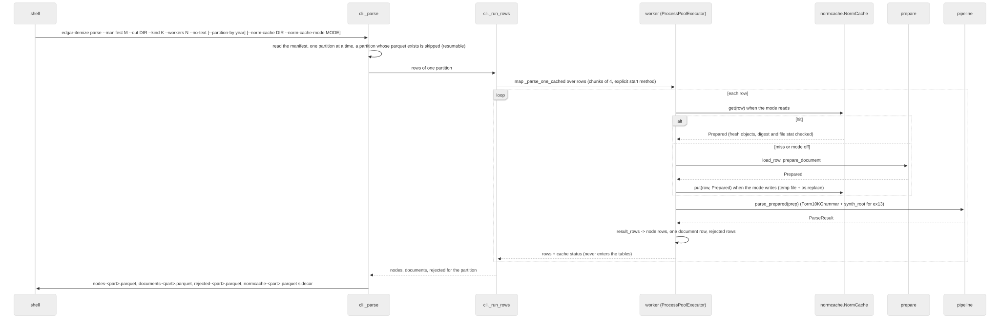

# Rendered diagrams

Generated by `scripts/render_diagrams.py` from the ```mermaid blocks of `docs/ARCHITECTURE.md`
and `docs/RULES.md`; do not edit the `.mmd` or `.svg` files by hand. Rerun after editing either
source (`docs/RULES.md` first via `scripts/rules_catalogue.py`).

- `architecture-01-1-from-edgar-to-a-citation.svg` (ARCHITECTURE.md) 
- `architecture-02-2-one-document-through-the-parser.svg` (ARCHITECTURE.md) 
- `architecture-03-3-grammar-routing.svg` (ARCHITECTURE.md) 
- `architecture-04-4a-form-10-k-10-q-tree-build-tree.svg` (ARCHITECTURE.md) 
- `architecture-05-4b-contracts-ex-10-kind-text-tree-contract-build.svg` (ARCHITECTURE.md) 
- `architecture-06-5-a-candidate-s-life.svg` (ARCHITECTURE.md) 
- `architecture-07-6-paths-segments-and-the-back-matter.svg` (ARCHITECTURE.md) 
- `architecture-08-7-a-run-the-cli-workers-and-the-cache.svg` (ARCHITECTURE.md) 
- `architecture-09-8-the-objects.svg` (ARCHITECTURE.md) 
- `rules-01-which-stage-reads-what-another-wrote.svg` (RULES.md) 
